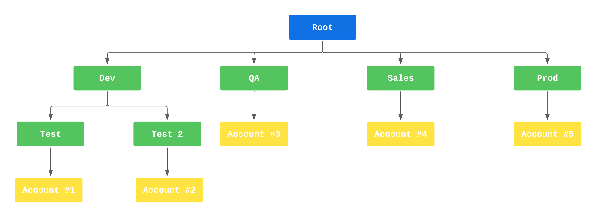

# Multiple-AWS-Account-Management-using-AWS-Organizations

Na AWS, o OU (Organizational Unit) é uma unidade organizacional que pode ser usada para agrupar recursos e contas em uma hierarquia. Isso permite que você gerencie de forma mais eficiente os recursos e as contas em sua organização, definindo permissões e políticas em nível de OU.

Uma OU pode ser usada para agrupar contas da AWS e recursos, como buckets do S3, instâncias do EC2, bancos de dados do RDS, entre outros. Isso facilita a aplicação de políticas de segurança e acesso, como permissões de IAM, de forma consistente em todos os recursos e contas dentro da OU.

Para utilizar uma OU na AWS, você precisa criar uma hierarquia de OU que reflete a estrutura da sua organização. Cada OU pode ter suas próprias políticas e permissões definidas, e essas políticas serão herdadas pelos recursos e contas associados a ela.

Por exemplo, se você tiver uma OU para seus recursos de produção e outra para seus recursos de teste, poderá aplicar políticas diferentes para cada OU. Além disso, se você tiver várias contas da AWS para diferentes equipes ou projetos, pode agrupá-las em uma OU correspondente a cada equipe ou projeto, facilitando a gestão e o acesso.

Em resumo, o uso de OU na AWS permite que você gerencie de forma mais eficiente seus recursos e contas em uma hierarquia organizacional, definindo políticas e permissões de acesso de forma consistente e centralizada. Isso ajuda a garantir a segurança e conformidade em toda a sua organização.

## IAM Policy

As políticas IAM (Identity and Access Management) são usadas na AWS para controlar o acesso aos recursos e serviços. As políticas IAM definem permissões para usuários, grupos e funções dentro de uma conta da AWS. Com as políticas IAM, você pode conceder ou negar acesso a recursos e serviços específicos.

As políticas IAM são compostas de recursos, ações e efeitos. Os recursos são os objetos da AWS que você deseja proteger, como buckets do S3, instâncias do EC2, bancos de dados do RDS, etc. As ações são as operações que podem ser executadas nos recursos, como ler, gravar ou excluir. Os efeitos definem se a ação será permitida ou negada.

Você pode criar políticas IAM personalizadas ou usar políticas pré-definidas fornecidas pela AWS. As políticas IAM personalizadas são criadas como documentos JSON e podem ser anexadas a usuários, grupos ou funções. As políticas pré-definidas são chamadas de políticas gerenciadas e incluem permissões comuns para serviços da AWS, como o Amazon S3, o Amazon EC2, o Amazon RDS e outros.

Para usar as políticas IAM, é necessário criar usuários, grupos ou funções com as permissões apropriadas. Os usuários são indivíduos com contas da AWS, enquanto os grupos são coleções de usuários com permissões semelhantes. As funções são entidades que definem um conjunto de permissões temporárias que podem ser assumidas por usuários ou serviços. Você pode atribuir políticas IAM a usuários, grupos ou funções para permitir ou negar o acesso a recursos e serviços específicos.

Em resumo, as políticas IAM são usadas para controlar o acesso a recursos e serviços na AWS. As políticas definem permissões para usuários, grupos e funções dentro de uma conta da AWS e podem ser personalizadas ou pré-definidas. Ao usar as políticas IAM, você pode garantir a segurança e conformidade em sua conta da AWS.